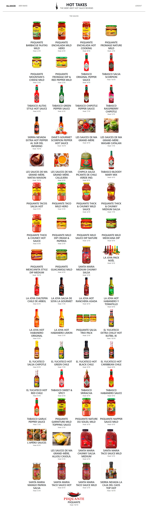
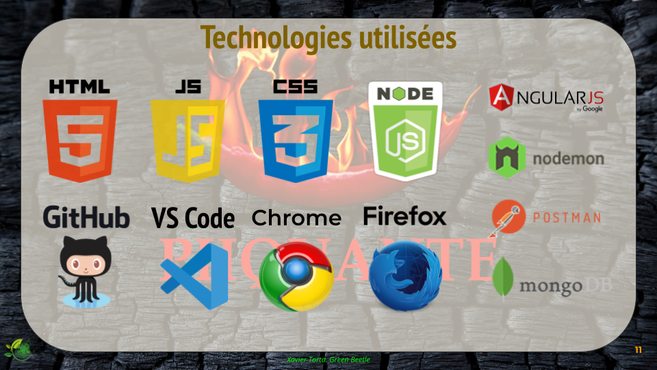
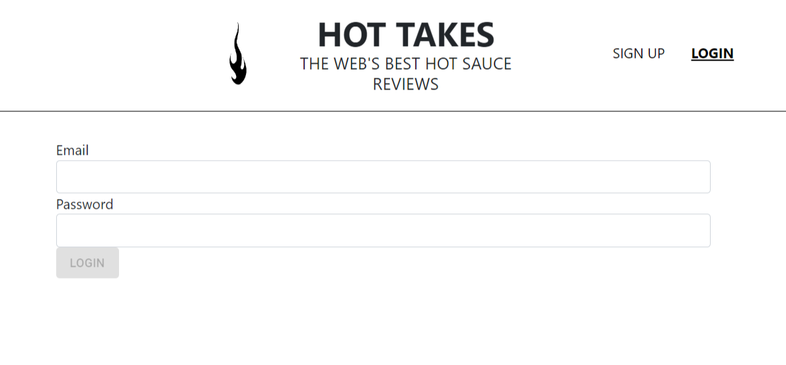
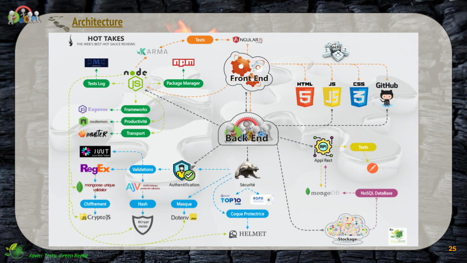
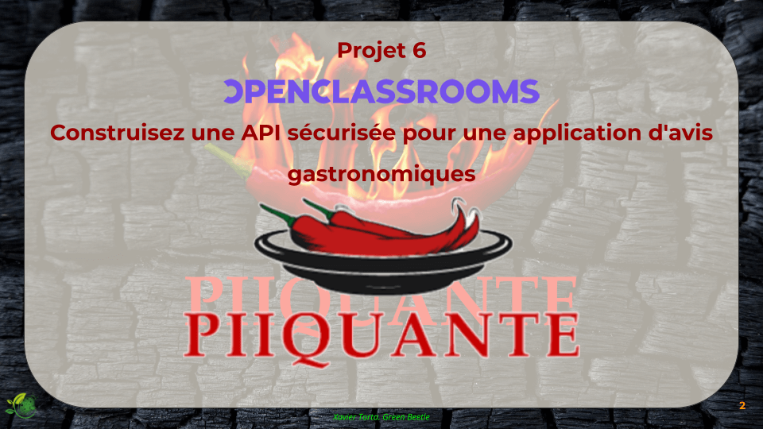
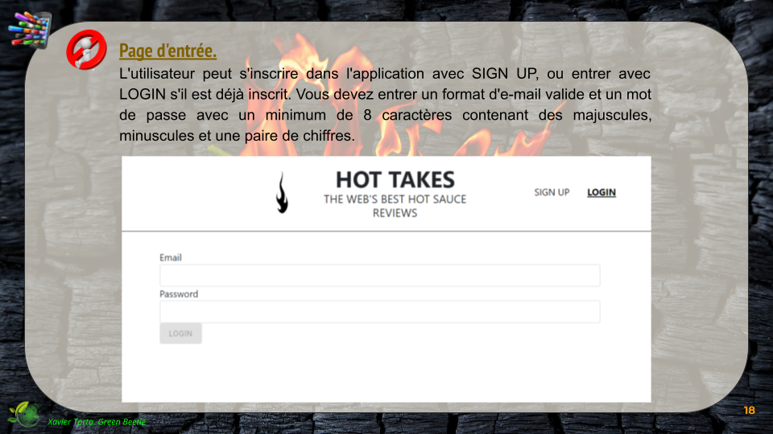
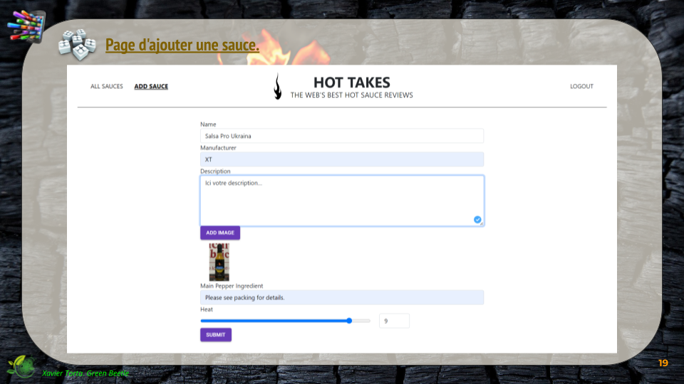
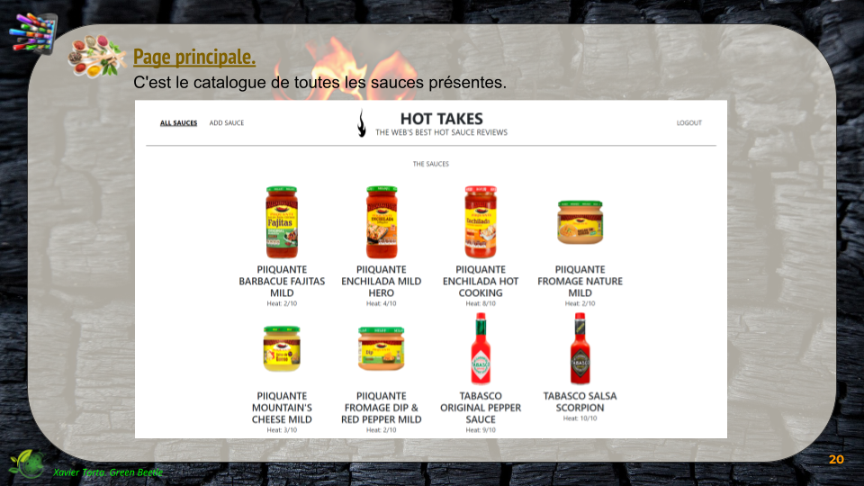
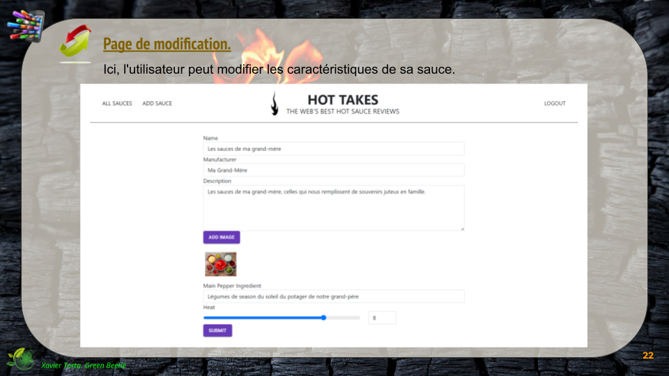

# Piiquante . HotTakes .

# <a href="https://openclassrooms.com/fr/paths/556/projects/676/assignment">P6 · Construisez une API sécurisée pour une application d'avis gastronomiques</a>.

## Presentation

· Vous trouverez <a href="https://docs.google.com/presentation/d/16_BSz3CeqxICZL_s0Rq516tE5Au1yhio-hUlBsWmHd0/edit?usp=sharing">ici, 👉 la Presentation HotTakes</a> de l'exposition du projet.

### Mise en service 

Vous pouvez accéder à la <a href="https://greenbeetlestore.github.io/Picante/">page d'entrée 👈 ici</a>. Vous devrez suivre les étapes de mise en service ci-dessous, et créer un compte fictif pour utiliser l'application.

· Cloner le dépôt, puis :

· $ cd backend / <b>nodemon server</b>        =  Listening on port 3000 - Connexion à MongoDB réussie !

· $ cd frontend / <b>npm run start</b>        =  ** Angular Live Development Server is listening on localhost:4200, open your browser on http://localhost:4200/ **

· Date de réalisation: octobre 2022.

## Technologies

### · Le côté front-end de ce projet a été généré avec <a href="https://github.com/angular/angular-cli">Angular CLI</a> version 13.2.4.

### · Les dépendances suivantes ont été utilisées dans la partie back-end :

   · **ajv 8.11.0** <a href="https://ajv.js.org/">Ajv JSON schema validator.</a>
   
   
   
   · **bcrypt 5.1.0** <a href="https://www.npmjs.com/package/bcrypt">Une bibliothèque pour vous aider à hacher les mots de passe.</a>
   
   
   
   · **body-parser 1.20.1** <a href="https://www.npmjs.com/package/body-parser">Analyse le corps (charge utile) des infos envoyées via des requêtes au serveur Web.</a>
   
   · **crypto-js 4.1.1** <a href="https://www.npmjs.com/package/crypto-js">Utilisé pour le cryptage des e-mails.</a>
   
   
   
   · **dotenv 16.0.3** <a href="https://www.npmjs.com/package/dotenv">Gère les variables d'environnement.</a>
   
   
   
   · **escape-html 1.0.3** <a href="https://www.npmjs.com/package/escape-html">Chaîne d'échappement à utiliser en HTML.</a>
   
   · **express 4.18.2** <a href="https://www.npmjs.com/package/express">Pour gérer notre serveur backend; Framework Web rapide, sans opinion et minimaliste.</a>
   
   
   
   · **express-session 1.17.3** <a href="https://www.npmjs.com/package/express-session">Middleware de session simple pour Express.</a>
   
   · **he 1.2.0** <a href="https://www.npmjs.com/package/he/v/1.2.0">Un encodeur/décodeur d'entité HTML robuste écrit en JavaScript.</a>
   
   · **helmet 6.0.0** <a href="https://helmetjs.github.io/">Helmet vous aide à sécuriser vos applications Express.js en définissant divers en-têtes HTTP.</a>
   
   
   
   · **html 1.0.0** <a href="https://www.npmjs.com/package/node-html/v/1.0.0-beta.20">Prototypage et construction de pages Web ou d'applications en aussi peu de lignes que possible.</a>
   
   · **jsonwebtoken 8.5.1** <a href="https://jwt.io/">Est une norme ouverte (RFC 7519) qui définit un moyen compact et autonome pour transmettre en toute sécurité des informations entre les parties en tant qu'objet JSON.</a>
   
   
   
   · **mongoose 6.6.5** <a href="https://mongoosejs.com/">Bibliothèque Node.js pour écrire des requêtes sur une base de données MongooDB.</a>
   
   
   
   · **mongoose-unique-validator 3.1.0** <a href="https://www.npmjs.com/package/mongoose-unique-validator">Est un plugin qui ajoute une validation de pré-enregistrement pour des champs uniques dans un schéma Mongoose.</a>
   
   
   
   · **multer 1.4.5-lts.1** <a href="https://www.npmjs.com/package/multer/v/1.4.5-lts.1">Il s'agit d'un middleware node.js pour la gestion des données multipart/form, qui est principalement utilisé pour le téléchargement de fichiers.</a>
   
   
   
   · **password-validator 5.3.0** <a href="https://www.npmjs.com/package/password-validator">Valide le mot de passe selon des spécifications flexibles et intuitives.</a>
 
  ### devDependencies: 
  
  · **morgan 1.10.0** <a href="https://www.npmjs.com/package/morgan">Intergiciel de journalisation des requêtes HTTP pour node.js.</a>
  
  
  
  ## Outils complémentaires
  
  · **Postman** Permet et facilite la création et l'utilisation d'API.

· **Nodemon** Surveille le système de fichiers et redémarre automatiquement le processus.

 

· **MongoDB** Il s'agit d'une base de données NoSQL orientée document pour stocker des volumes massifs de données telles que des collections et des documents.

  
 

## Open Source

Piquante est un projet open source, réalisé comme une simulation fictive d'une application en ligne pour publier et noter des sauces.

C'est un exercice obligatoire pour valider le projet 6 de la formation Développeur Web OpenClassrooms.

Vous pouvez collaborer, visiter, cloner ou l'utiliser pour votre propre apprentissage.

## Auteurs

### Développement front-end initial reçu pour suivre la mission : <a href="https://github.com/OpenClassrooms-Student-Center/Web-Developer-P6">luc.bourrat</a>

<a href="https://openclassrooms.com/fr/paths/556/projects/676/assignment"> P6 - OpenClassrooms</a>.

### Développement back-end : <a href="https://github.com/GreenBeetleStore/Piiquante"> Xavier Torta, the Green Beetle </a>

 

## Architecture

### Schéma de l'architecture

 
 
 

## Sécurité appliquée

● Pour appliquer les bonnes pratiques de sécurité, nous prenons comme référence les règles et conseils <a href="https://owasp.org/">OWASP</a> et <a href="https://rgpd.com/">RGPD</a>.

 
 
 

# L'App HotTakes by Piiquante

   
## UX - Expérience utilisateur

        

        

 
 
 

## Cours

### Développement

<a href= "https://openclassrooms.com/fr/courses/6390246-passez-au-full-stack-avec-node-js-express-et-mongodb"> Cours Passez au Full Stack avec Node.js, Express et MongoDB.</a>

<a href="https://openclassrooms.com/fr/courses/6573181-adoptez-les-api-rest-pour-vos-projets-web">Cours Adoptez les API REST pour vos projets web.</a>

### Cybersécurité

<a href="https://openclassrooms.com/fr/courses/6179306-securisez-vos-applications-web-avec-lowasp">Sécurisez vos applications web avec l'OWASP.</a>

## Ressources

*VIDÉO*

<a href="https://www.youtube.com/watch?v=NRxzvpdduvQ">Node JS Tutorial Français pour Débutant - Cours complet 8h [2022]</a>
Vous pouvez vous aider de certains chapitres de cette vidéo pour votre projet.

*SITE WEB*

<a href="http://expressjs.com/fr/">Utilisation d'Express</a>
Site web officiel d'Express.

*ARTICLES*

<a href="https://atinux.developpez.com/tutoriels/javascript/mongodb-nodejs-mongoose/">Comment connecter et utiliser votre MongoDB avec Node.js</a>
Tutoriel par Sébastien Chopin (02/2012).

<a href="https://ichi.pro/fr/gerez-les-variables-d-environnement-dans-votre-application-nodejs-avec-dotenv-90198954812747">Travailler avec des variables d'environnement</a>
Article sur ichi.pro.

<a href="https://www.ipgirl.com/1097/comprendre-rest-verbes-codes-derreur-et-authentification.html">Comprendre REST: Verbes, codes d’erreur et authentification</a>
Tutoriel par IP Girl (2017).

<a href="https://dev.to/aimalm/upload-single-file-in-node-js-using-express-and-multer-in-6-steps-4o9p">Configuration de multer</a>
Contenu rédigé en anglais, par Aimal Maarij, 04/2021 (v2: 05/2021).

<a href="https://ichi.pro/fr/telecharger-un-fichier-avec-multer-dans-les-applications-node-js-208100977885636">Configuration de multer</a>
Article sur ichi.pro.

<a href="https://developer.mozilla.org/fr/docs/Learn/JavaScript/First_steps/Arrays">Les méthodes des tableaux expliquées</a>
Guide de Mozilla officiel.

*LIVRE*

<a href="https://alexgirard.com/git-book/intermediaire/git-ignore/">Ajout ou suppression d'un fichier de gitignore</a>
§2.2 du Livre Pro Git, par Scott Chacon et Ben Straub, traduit par Alex Girard.

 

        
        
 
 
 
 
 

## <a href="https://s3.eu-west-1.amazonaws.com/course.oc-static.com/projects/DWJ_FR_P6/Guide+E%CC%81tapes+Cle%CC%81s_DW_P6.pdf">Guide des étapes clés</a>

## Étapes clés pour le P6 du parcours Développeur Web

### Création d’une API sécurisée pour une application d'évaluation

Dans ce document, vous trouverez un exemple des étapes clés à suivre pour mener à bien votre projet. Vous verrez :

        ● Quelles parties du livrable correspondent aux différentes étapes clés.
        ● Les méthodes pour mener à bien chaque étape.
        ● Les problèmes potentiels à connaître ou les erreurs à éviter.
        ● Le temps nécessaire estimé de l'ensemble du projet.
        ● Des ressources externes utiles pour chaque étape.

### Recommandations générales

À chaque étape, assurez-vous que le serveur démarre correctement, avec un message dans la console indiquant que le serveur a démarré et s'est connecté avec succès à MongoDB. Si vous recevez un message indiquant que le serveur ne parvient pas à démarrer,vérifiez qu’il n’y ait pas d'erreur dans la console du backend.

Testez votre code à chaque grande étape. Des tests fréquents peuvent vous éviter d'oublier des parties importantes du code et vous alerter sur les erreurs.

## Étape 1 : Démarrer le serveur backend

15 % d’avance

### 🎯 Partie du livrable :

        Projet initialisé

### 📌 Recommandations :

● Suivez ces étapes :

        ○ Créer un projet vide pour démarrer le serveur Node.js ;
        ○ Installer Express ;
        ○ Installer Mongoose.

● À partir de la version 4.16 d'Express, bodyparser est inclus et vous n'avez pas besoin de l'installer.

        ○ Utilisez ( express.json() ) pour analyser le corps de la requête.

### ⚠️ Les problèmes à connaître :

● Si le port 3000 est utilisé par un autre processus, redémarrez complètement votre ordinateur (pour permettre l'utilisation du port) ou changez le port utilisé dans l’application Express.

● Impossible de se connecter à MongoDB. Vérifiez la chaîne de connexion, le nom d'utilisateur et le mot de passe de MongoDB et vérifiez que MongoDB Atlas (ou un service similaire) autorise toutes les adresses IP à se connecter au cluster.

### 📃 Ressources (en anglais)

● <a href="http://expressjs.com/fr/">Utilisation d'Express</a>

● <a href="https://atinux.developpez.com/tutoriels/javascript/mongodb-nodejs-mongoose/">Comment connecter et utiliser votre MongoDb avec Node.js</a>

● <a href="https://ichi.pro/fr/gerez-les-variables-d-environnement-dans-votre-application-nodejs-avec-dotenv-90198954812747">Travailler avec des variables d'environnement</a>

## Étape 2 : Construire le parcours utilisateur

30 % d’avance

### 🎯 Partie du livrable :
        API

### 📌 Recommandations :

● Créez les éléments suivants :

        ○ Modèle d'utilisateur ;
        ○ Parcours utilisateur ;
        ○ Contrôleur d'utilisateur.

● L'utilisateur est en mesure d'effectuer les opérations suivantes :

        ○ Créer un compte ;
        ○ Se connecter et disposer d'un token valide.

● Consultez l'onglet réseau de Devtools pour plus d'informations.

### ⚠️ Les problèmes à connaître :

● Le mot de passe n'est pas haché. Veillez à hacher le mot de passe.

● Un utilisateur peut s'inscrire plusieurs fois avec la même adresse électronique. Assurez-vous que le code vérifie qu’une adresse électronique est unique.

### 📃 Ressources

● <a href="https://mobiskill.fr/blog/conseils-emploi-tech/les-meilleures-pratiques-pour-le-developpement-de-rest-api/">Ce que sont les verbes de requêtes d'API.</a>

## Étape 3 : Démarrer le middleware

40 % d’avance

### 🎯 Partie du livrable : 
        API

### 📌 Recommandations :

● Ajout de multer pour les images.

● Ajout d’authorize pour la validation des tokens.

        ○ Authorize doit être ajoutée avant de commencer à construire le parcours pour les sauces car l'authentification est nécessaire pour qu'un utilisateur puisse effectuer une action sur le parcours des sauces.

### ⚠️ Les problèmes à connaître :

● Les images importées sont manquantes.

● Multer n'est pas correctement configuré.

● Le chemin statique n'a pas été ajouté à l'application pour fournir les images. Assurez-vous d'ajouter le chemin statique à l'application.

### 📃 Ressources

● <a href="https://dev.to/aimalm/upload-single-file-in-node-js-using-express-and-multer-in-6-steps-4o9p">Configuration of multer</a> (en anglais).

● <a href="https://ichi.pro/fr/telecharger-un-fichier-avec-multer-dans-les-applications-node-js-208100977885636">Configuration de multer</a> (en français).

## Étape 4 : Construire la route Sauce de l’API
70 % d’avance

### 🎯 Partie du livrable : 
        API
        
### 📌 Recommandations :

● Créez les éléments suivants :

        ○ Le Modèle Sauce ;
        ○ La Route Sauce ;
        ○ Le Contrôleur Sauce.

● Autorisez toutes les fonctions en utilisant middleware Authorize.

● L'utilisateur est en mesure d'effectuer les opérations suivantes :

        ○ Ajouter une nouvelle sauce ;
        ○ Supprimer une sauce ;
        ○ Voir toutes les sauces.

● Consultez l'onglet réseau de Devtools pour plus d'informations.

### ⚠️ Les problèmes à connaître :

● Erreur 401 (l'utilisateur n'est pas autorisé).

● Multer ne sauvegarde pas les images.

● Les images ne sont pas affichées sur le frontend.

### 📃 Ressources

● <a href="https://alexgirard.com/git-book/intermediaire/git-ignore/">Ajout ou suppression d'un fichier de gitignore</a>.

● <a href="https://developer.mozilla.org/fr/docs/Learn/JavaScript/First_steps/Arrays">Les méthodes des tableaux expliquées</a>.

## Étape 5 : Terminer la route Sauce de l’API
100 % d’avance

### 🎯 Partie du livrable : 
        API complété

### 📌 Recommandations :

● Exécutez l'application en tant qu'utilisateur pour vérifier que toutes les fonctions ont été correctement mises en œuvre, testez :

        ○ Les deux types de demandes :
                ■ Avec un fichier présent ;
                ■ Sans fichier.
                
        ○ Les trois scénarios de la fonction « like » (1, 0, -1) ;
                ■ L’utilisateur peut liker ou ne pas aimer une sauce (ou aucun des deux)
                
        ○ Seul le propriétaire de la sauce peut modifier ou supprimer une sauce existante.

### ⚠️ Les problèmes à connaître :

● Erreur 401 (l'utilisateur n'est pas autorisé).

● Multer ne sauvegarde pas les images.

● Les images ne sont pas affichées sur le frontend.

● Les données ne sont pas modifiées lorsque l'utilisateur tente de modifier une sauce existante.

● La fonction « modifier » échoue lorsqu'une image est téléchargée ou modifiée.

● La fonction « like » échoue lorsque l'utilisateur essaie de liker ou de ne pas aimer une sauce plusieurs fois.

● Le propriétaire de la sauce ne peut pas voir les boutons « modifier » et « supprimer ». L'identifiant de la Sauce doit être valide et ne pas contenir de faute de frappe, car seul le propriétaire de la Sauce peut la modifier ou la supprimer.

## 🎉 Projet terminé !

 
 
 
 
 

# <a href="https://s3.eu-west-1.amazonaws.com/course.oc-static.com/projects/DWJ_FR_P6/Requirements_DW_P6.pdf">Requirements</a>

# Application API Requirements

## Contexte du projet

Piiquante se dédie à la création de sauces épicées dont les recettes sont gardées secrètes. Pour tirer parti de son succès et générer davantage de buzz, l'entreprise souhaite créer une application web dans laquelle les utilisateurs peuvent ajouter leurs sauces préférées et liker ou disliker les sauces ajoutées par les autres.

## Spécifications de l'API
| Verb | Point d'accès | Request body | Type de réponse attendue | Fonction |
| :---: | :---: | :---: | :---: | :---: |
| POST | /api/auth/signup | { email: string, password: string } | { message: string } | Hachage du mot de passe de l'utilisateur, ajout de l'utilisateur à la base de données. |
| POST | /api/auth/login | { email: string, password: string } | { userId: string, token: string } | Vérification des informations d'identification de l'utilisateur, renvoie l'_id de l'utilisateur depuis la base de données et un token web JSON signé (contenant également l'_id de l'utilisateur). |
| GET | /api/sauces | - | Array of sauces | Renvoie un tableau de toutes les sauces de la base de données. |
| GET | /api/sauces/:id  | - | Single sauce | Renvoie la sauce avec l’_id fourni. |
| POST | /api/sauces | { sauce: String, image: File } | { message: String } **Verb** | Capture et enregistre l'image, analyse la sauce transformée en chaîne de caractères et l'enregistre dans la base de données en définissant correctement son imageUrl. Initialise les likes et dislikes de la sauce à 0 et les usersLiked et usersDisliked avec des tableaux vides. Remarquez que le corps de la demande initiale est vide ; lorsque multer est ajouté, il renvoie une chaîne pour le corps de la demande en fonction des données soumises avec le fichier.
| PUT | /api/sauces/:id | EITHER Sauce as JSON OR { sauce: String, image: File } | { message: String } | Met à jour la sauce avec l'_id fourni. Si une image est téléchargée, elle est capturée et l’imageUrl de la sauce est mise à jour. Si aucun fichier n'est fourni, les informations sur la sauce se trouvent directement dans le corps de la requête (req.body.name, req.body.heat, etc.). Si un fichier est fourni, la sauce transformée en chaîne de caractères se trouve dans req.body.sauce. Notez que le corps de la demande initiale est vide ; lorsque multer est ajouté, il renvoie une chaîne du corps de la demande basée sur les données soumises avec le fichier.  |
| DELETE | /api/sauces/:id | - | { message: String } | Supprime la sauce avec l'_id fourni. |
| POST | /api/sauces/:id/like | { userId: String, like: Number } | { message: String } | Définit le statut « Like » pour l' userId fourni. Si like = 1, l'utilisateur aime (= like) la sauce. Si like = 0, l'utilisateur annule son like ou son dislike. Si like = -1, l'utilisateur n'aime pas (= dislike) la sauce. L'ID de l'utilisateur doit être ajouté ou retiré du tableau approprié. Cela permet de garder une trace de leurs préférences et les empêche de liker ou de ne pas disliker la même sauce plusieurs fois : un utilisateur ne peut avoir qu'une seule valeur pour chaque sauce. Le nombre total de « Like » et de « Dislike » est mis à jour à chaque nouvelle notation. |

### API Errors

Les erreurs éventuelles doivent être renvoyées telles qu'elles sont produites, sans modification ni ajout. Si nécessaire, utilisez une nouvelle Error().

### API Routes

Toutes les routes sauce pour les sauces doivent disposer d’une autorisation (le token est envoyé par le front-end avec l'en-tête d’autorisation : « Bearer <token> »).

Avant que l'utilisateur puisse apporter des modifications à la route sauce, le code doit vérifier si l'userId actuel correspond à l'userId de la sauce. Si l'userId ne correspond pas, renvoyer « 403: unauthorized request. » Cela permet de s'assurer que seul le propriétaire de la sauce peut apporter des modifications à celle-ci.

# Data ModelsSauce

● **userId** : String — l'identifiant MongoDB unique de l'utilisateur qui a créé la sauce

● **name** : String — nom de la sauce

● **manufacturer** : String — fabricant de la sauce

● **description** : String — description de la sauce

● **mainPepper** : String — le principal ingrédient épicé de la sauce

● **imageUrl** : String — l'URL de l'image de la sauce téléchargée par l'utilisateur

● **heat** : Number — nombre entre 1 et 10 décrivant la sauce

● **likes** : Number — nombre d'utilisateurs qui aiment (= likent) la sauce

● **dislikes** : Number — nombre d'utilisateurs qui n'aiment pas (= dislike) la sauce

● **usersLiked** : [ "String `<userId>`" ] — tableau des identifiants des utilisateurs qui ont aimé (= liked) la sauce

● **usersDisliked** : [ "String `<userId>`" ] — tableau des identifiants des utilisateurs qui n'ont pas aimé (= disliked) la sauce 

### Utilisateur

● **email** : String — adresse e-mail de l'utilisateur **[unique]**

● **password** : String — mot de passe de l'utilisateur haché

## Exigences de sécurité

● Le mot de passe de l'utilisateur doit être haché.

● L'authentification doit être renforcée sur toutes les routes sauce requises.

● Les adresses électroniques dans la base de données sont uniques et un plugin Mongoose approprié est utilisé pour garantir leur unicité et signaler les erreurs.

● La sécurité de la base de données MongoDB (à partir d'un service tel que MongoDB Atlas) ne doit pas empêcher l'application de se lancer sur la machine d'un utilisateur.

● Un plugin Mongoose doit assurer la remontée des erreurs issues de la base de données.

● Les versions les plus récentes des logiciels sont utilisées avec des correctifs de sécurité actualisés.

● Le contenu du dossier images ne doit pas être téléchargé sur GitHub.

## Repository GitHub

Retirez le code de l'application front-end du repository du projet et suivez les étapes suivantes :

        1. Clonez le repository
        
        2. Ouvrez un terminal (Linux/Mac) ou une invite de commande/PowerShell (Windows)
        
        3. Exécutez npm install à partir du répertoire du projet
        
        4. Exécutez npm start
        
        5. Exécutez le back-end sur http://localhost:3000 seulement

Si vous utilisez VSCode, utilisez l'extension LiveShare pour faire fonctionner le serveur front-end sans avoir recours à npm install.

 
 
 
 

