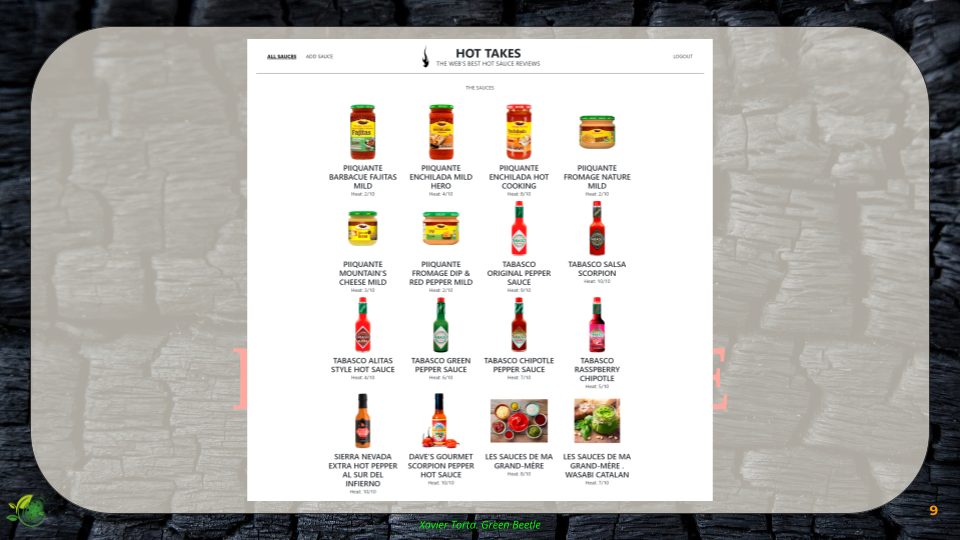
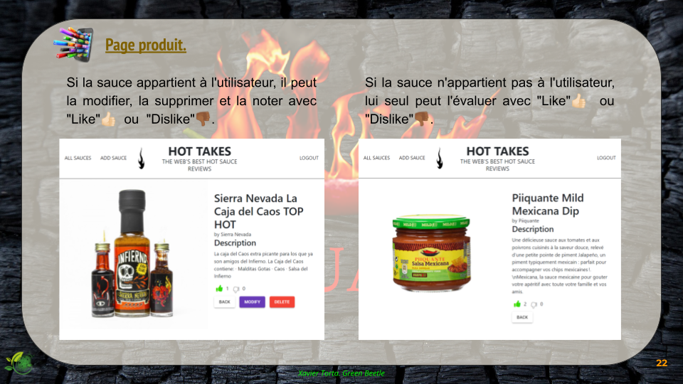

# Piiquante . HotTakes .
# P6 · Construisez une API sécurisée pour une application d'avis gastronomiques.

## Presentation

· Vous trouverez ci-dessous la présentation de l'exposition du projet.

<a href="https://docs.google.com/presentation/d/16_BSz3CeqxICZL_s0Rq516tE5Au1yhio-hUlBsWmHd0/edit?usp=sharing">Presentation HotTakes</a>

· Date de réalisation: octobre 2022.

## Technologies

· Le côté front-end de ce projet a été généré avec <a href="https://github.com/angular/angular-cli">Angular CLI</a> version 13.2.4.

## Open Source

Piquante est un projet open source, réalisé comme une simulation fictive d'une application en ligne pour publier et noter des sauces.

C'est un exercice obligatoire pour valider le projet 6 de la formation Développeur Web OpenClassrooms.

Vous pouvez collaborer, visiter, cloner ou l'utiliser pour votre propre apprentissage.

## Auteurs

Développement front-end : https://github.com/lucbourrat . <a href="https://openclassrooms.com/fr/paths/556/projects/676/assignment"> OpenClassrooms</a>.

Développement back-end : <a href="https://github.com/GreenBeetleStore/Piiquante"> Xavier Torta, the Green Beetle </a>

## <a href="https://s3.eu-west-1.amazonaws.com/course.oc-static.com/projects/DWJ_FR_P6/Guide+E%CC%81tapes+Cle%CC%81s_DW_P6.pdf">Guide des étapes clés</a>

## Étapes clés pour le P6 du parcours Développeur Web

### Création d’une API sécurisée pour une application d'évaluation

Dans ce document, vous trouverez un exemple des étapes clés à suivre pour mener à bien votre projet. Vous verrez :

        ● Quelles parties du livrable correspondent aux différentes étapes clés.
        ● Les méthodes pour mener à bien chaque étape.
        ● Les problèmes potentiels à connaître ou les erreurs à éviter.
        ● Le temps nécessaire estimé de l'ensemble du projet.
        ● Des ressources externes utiles pour chaque étape.
        
### Recommandations générales

À chaque étape, assurez-vous que le serveur démarre correctement, avec un message dans la console indiquant que le serveur a démarré et s'est connecté avec succès à MongoDB. Si vous recevez un message indiquant que le serveur ne parvient pas à démarrer,vérifiez qu’il n’y ait pas d'erreur dans la console du backend.

Testez votre code à chaque grande étape. Des tests fréquents peuvent vous éviter d'oublier des parties importantes du code et vous alerter sur les erreurs.

## Étape 1 : Démarrer le serveur backend
15 % d’avance

### 🎯 Partie du livrable : 
        Projet initialisé
        
### 📌 Recommandations :

● Suivez ces étapes :

        ○ Créer un projet vide pour démarrer le serveur Node.js ;
        ○ Installer Express ;
        ○ Installer Mongoose.
        
● À partir de la version 4.16 d'Express, bodyparser est inclus et vous n'avez pas besoin de l'installer.

        ○ Utilisez ( express.json() ) pour analyser le corps de la requête.
        
### ⚠️ Les problèmes à connaître :

● Si le port 3000 est utilisé par un autre processus, redémarrez complètement votre ordinateur (pour permettre l'utilisation du port) ou changez le port utilisé dans l’application Express.

● Impossible de se connecter à MongoDB. Vérifiez la chaîne de connexion, le nom d'utilisateur et le mot de passe de MongoDB et vérifiez que MongoDB Atlas (ou un service similaire) autorise toutes les adresses IP à se connecter au cluster.

### 📃 Ressources (en anglais)

● <a href="http://expressjs.com/fr/">Utilisation d'Express</a>

● <a href="https://atinux.developpez.com/tutoriels/javascript/mongodb-nodejs-mongoose/">Comment connecter et utiliser votre MongoDb avec Node.js</a>

● <a href="https://ichi.pro/fr/gerez-les-variables-d-environnement-dans-votre-application-nodejs-avec-dotenv-90198954812747">Travailler avec des variables d'environnement</a>

## Étape 2 : Construire le parcours utilisateur
30 % d’avance

### 🎯 Partie du livrable : 
        API
        
### 📌 Recommandations :

● Créez les éléments suivants :

        ○ Modèle d'utilisateur ;
        ○ Parcours utilisateur ;
        ○ Contrôleur d'utilisateur.
        
● L'utilisateur est en mesure d'effectuer les opérations suivantes :

        ○ Créer un compte ;
        ○ Se connecter et disposer d'un token valide.
        
● Consultez l'onglet réseau de Devtools pour plus d'informations.

### ⚠️ Les problèmes à connaître :

● Le mot de passe n'est pas haché. Veillez à hacher le mot de passe.

● Un utilisateur peut s'inscrire plusieurs fois avec la même adresse électronique. Assurez-vous que le code vérifie qu’une adresse électronique est unique.

### 📃 Ressources

● <a href="https://mobiskill.fr/blog/conseils-emploi-tech/les-meilleures-pratiques-pour-le-developpement-de-rest-api/">Ce que sont les verbes de requêtes d'API.</a>

## Étape 3 : Démarrer le middleware
40 % d’avance

### 🎯 Partie du livrable : 
        API
        
### 📌 Recommandations :

● Ajout de multer pour les images.

● Ajout d’authorize pour la validation des tokens.

        ○ Authorize doit être ajoutée avant de commencer à construire le parcours pour les sauces car l'authentification est nécessaire pour qu'un utilisateur puisse effectuer une action sur le parcours des sauces.
        
### ⚠️ Les problèmes à connaître :

● Les images importées sont manquantes.

● Multer n'est pas correctement configuré.

● Le chemin statique n'a pas été ajouté à l'application pour fournir les images. Assurez-vous d'ajouter le chemin statique à l'application.

### 📃 Ressources

● <a href="https://dev.to/aimalm/upload-single-file-in-node-js-using-express-and-multer-in-6-steps-4o9p">Configuration of multer</a> (en anglais).
● <a href="https://ichi.pro/fr/telecharger-un-fichier-avec-multer-dans-les-applications-node-js-208100977885636">Configuration de multer</a> (en français).

## Étape 4 : Construire la route Sauce de l’API
70 % d’avance

### 🎯 Partie du livrable : 
        API
        
### 📌 Recommandations :

● Créez les éléments suivants :

        ○ Le Modèle Sauce ;
        ○ La Route Sauce ;
        ○ Le Contrôleur Sauce.
        
● Autorisez toutes les fonctions en utilisant middleware Authorize.

● L'utilisateur est en mesure d'effectuer les opérations suivantes :

        ○ Ajouter une nouvelle sauce ;
        ○ Supprimer une sauce ;
        ○ Voir toutes les sauces.
        
● Consultez l'onglet réseau de Devtools pour plus d'informations.

### ⚠️ Les problèmes à connaître :

● Erreur 401 (l'utilisateur n'est pas autorisé).

● Multer ne sauvegarde pas les images.

● Les images ne sont pas affichées sur le frontend.

### 📃 Ressources

● <a href="https://alexgirard.com/git-book/intermediaire/git-ignore/">Ajout ou suppression d'un fichier de gitignore</a>.

● <a href="https://developer.mozilla.org/fr/docs/Learn/JavaScript/First_steps/Arrays">Les méthodes des tableaux expliquées</a>.

## Étape 5 : Terminer la route Sauce de l’API
100 % d’avance

### 🎯 Partie du livrable : 
        API complété
        
### 📌 Recommandations :

● Exécutez l'application en tant qu'utilisateur pour vérifier que toutes les fonctions ont été correctement mises en œuvre, testez :

        ○ Les deux types de demandes :
                ■ Avec un fichier présent ;
                ■ Sans fichier.
                
        ○ Les trois scénarios de la fonction « like » (1, 0, -1) ;
                ■ L’utilisateur peut liker ou ne pas aimer une sauce (ou aucun des deux)
                
        ○ Seul le propriétaire de la sauce peut modifier ou supprimer une sauce existante.
        
### ⚠️ Les problèmes à connaître :

● Erreur 401 (l'utilisateur n'est pas autorisé).

● Multer ne sauvegarde pas les images.

● Les images ne sont pas affichées sur le frontend.

● Les données ne sont pas modifiées lorsque l'utilisateur tente de modifier une sauce existante.

● La fonction « modifier » échoue lorsqu'une image est téléchargée ou modifiée.

● La fonction « like » échoue lorsque l'utilisateur essaie de liker ou de ne pas aimer une sauce plusieurs fois.

● Le propriétaire de la sauce ne peut pas voir les boutons « modifier » et « supprimer ». L'identifiant de la Sauce doit être valide et ne pas contenir de faute de frappe, car seul le propriétaire de la Sauce peut la modifier ou la supprimer.

## 🎉 Projet terminé !

 
 
 
 
 

## <a href="https://s3.eu-west-1.amazonaws.com/course.oc-static.com/projects/DWJ_FR_P6/Requirements_DW_P6.pdf">Requirements</a>

## Application API Requirements

### Contexte du projet

Piiquante se dédie à la création de sauces épicées dont les recettes sont gardées secrètes. Pour tirer parti de son succès et générer davantage de buzz, l'entreprise souhaite créer une application web dans laquelle les utilisateurs peuvent ajouter leurs sauces préférées et liker ou disliker les sauces ajoutées par les autres.

### Spécifications de l'API
| Verb | Point d'accès | Request body | Type de réponse attendue | Fonction |
| :---: | :---: | :---: | :---: | :---: |
| POST | /api/auth/signup | { email: string, password: string } | { message: string } | Hachage du mot de passe de l'utilisateur, ajout de l'utilisateur à la base de données. |
| POST | /api/auth/login | { email: string, password: string } | { userId: string, token: string } | Vérification des informations d'identification de l'utilisateur, renvoie l'_id de l'utilisateur depuis la base de données et un token web JSON signé (contenant également l'_id de l'utilisateur). |
| GET | /api/sauces | - | Array of sauces | Renvoie un tableau de toutes les sauces de la base de données. |
| GET | /api/sauces/:id  | - | Single sauce | Renvoie la sauce avec l’_id fourni. |
| POST | /api/sauces | { sauce: String, image: File } | { message: String } **Verb** | Capture et enregistre l'image, analyse la sauce transformée en chaîne de caractères et l'enregistre dans la base de données en définissant correctement son imageUrl. Initialise les likes et dislikes de la sauce à 0 et les usersLiked et usersDisliked avec des tableaux vides. Remarquez que le corps de la demande initiale est vide ; lorsque multer est ajouté, il renvoie une chaîne pour le corps de la demande en fonction des données soumises avec le fichier.
| PUT | /api/sauces/:id | EITHER Sauce as JSON OR { sauce: String, image: File } | { message: String } | Met à jour la sauce avec l'_id fourni. Si une image est téléchargée, elle est capturée et l’imageUrl de la sauce est mise à jour. Si aucun fichier n'est fourni, les informations sur la sauce se trouvent directement dans le corps de la requête (req.body.name, req.body.heat, etc.). Si un fichier est fourni, la sauce transformée en chaîne de caractères se trouve dans req.body.sauce. Notez que le corps de la demande initiale est vide ; lorsque multer est ajouté, il renvoie une chaîne du corps de la demande basée sur les données soumises avec le fichier.  |
| DELETE | /api/sauces/:id | - | { message: String } | Supprime la sauce avec l'_id fourni. |
| POST | /api/sauces/:id/like | { userId: String, like: Number } | { message: String } | Définit le statut « Like » pour l' userId fourni. Si like = 1, l'utilisateur aime (= like) la sauce. Si like = 0, l'utilisateur annule son like ou son dislike. Si like = -1, l'utilisateur n'aime pas (= dislike) la sauce. L'ID de l'utilisateur doit être ajouté ou retiré du tableau approprié. Cela permet de garder une trace de leurs préférences et les empêche de liker ou de ne pas disliker la même sauce plusieurs fois : un utilisateur ne peut avoir qu'une seule valeur pour chaque sauce. Le nombre total de « Like » et de « Dislike » est mis à jour à chaque nouvelle notation. |

### API Errors

Les erreurs éventuelles doivent être renvoyées telles qu'elles sont produites, sans
modification ni ajout. Si nécessaire, utilisez une nouvelle Error().
API Routes
Toutes les routes sauce pour les sauces doivent disposer d’une autorisation (le
token est envoyé par le front-end avec l'en-tête d’autorisation : « Bearer <token> »).
Avant que l'utilisateur puisse apporter des modifications à la route sauce, le code
doit vérifier si l'userId actuel correspond à l'userId de la sauce. Si l'userId ne
correspond pas, renvoyer « 403: unauthorized request. » Cela permet de s'assurer
que seul le propriétaire de la sauce peut apporter des modifications à celle-ci.
Data ModelsSauce
● userId : String — l'identifiant MongoDB unique de l'utilisateur qui a créé la
sauce
● name : String — nom de la sauce
● manufacturer : String — fabricant de la sauce
● description : String — description de la sauce
● mainPepper : String — le principal ingrédient épicé de la sauce
● imageUrl : String — l'URL de l'image de la sauce téléchargée par l'utilisateur
● heat : Number — nombre entre 1 et 10 décrivant la sauce
● likes : Number — nombre d'utilisateurs qui aiment (= likent) la sauce
● dislikes : Number — nombre d'utilisateurs qui n'aiment pas (= dislike) la
sauce
● usersLiked : [ "String <userId>" ] — tableau des identifiants des utilisateurs
qui ont aimé (= liked) la sauce
● usersDisliked : [ "String <userId>" ] — tableau des identifiants des
utilisateurs qui n'ont pas aimé (= disliked) la sauce
Utilisateur
● email : String — adresse e-mail de l'utilisateur [unique]
● password : String — mot de passe de l'utilisateur haché
Exigences de sécurité
● Le mot de passe de l'utilisateur doit être haché.
● L'authentification doit être renforcée sur toutes les routes sauce requises.
● Les adresses électroniques dans la base de données sont uniques et un
plugin Mongoose approprié est utilisé pour garantir leur unicité et signaler
les erreurs.
● La sécurité de la base de données MongoDB (à partir d'un service tel que
MongoDB Atlas) ne doit pas empêcher l'application de se lancer sur la
machine d'un utilisateur.
● Un plugin Mongoose doit assurer la remontée des erreurs issues de la base
de données.
● Les versions les plus récentes des logiciels sont utilisées avec des correctifs
de sécurité actualisés.
● Le contenu du dossier images ne doit pas être téléchargé sur GitHub.
Repository GitHub
Retirez le code de l'application front-end du repository du projet et suivez les
étapes suivantes :
1. Clonez le repository
2. Ouvrez un terminal (Linux/Mac) ou une invite de commande/PowerShell
(Windows)
3. Exécutez npm install à partir du répertoire du projet
4. Exécutez npm start
5. Exécutez le back-end sur http://localhost:3000 seulement
Si vous utilisez VSCode, utilisez l'extension LiveShare pour faire fonctionner le
serveur front-end sans avoir recours à npm install.

# HotTakes

This project was generated with <a href="https://github.com/angular/angular-cli">Angular CLI</a> version 13.2.4.

## Development server
Run <mark>ng serve</mark> for a dev server. Navigate to http://localhost:4200/. The app will automatically reload if you change any of the source files.

## Code scaffolding
Run <mark>ng generate component component-name</mark> to generate a new component. You can also use <mark>ng generate directive|pipe|service|class|guard|interface|enum|module</mark>.

## Build
Run <mark>ng build</mark> to build the project. The build artifacts will be stored in the <q>dist/</q> directory.

## Running unit tests
Run <mark>ng test</mark> to execute the unit tests via <a href="https://karma-runner.github.io/">Karma</a>.

## Running end-to-end tests
Run <mark>ng e2e</mark> to execute the end-to-end tests via a platform of your choice. To use this command, you need to first add a package that implements end-to-end testing capabilities.

## Further help
To get more help on the Angular CLI use <mark>ng help</mark> or go check out the <a href="https://angular.io/cli"> Angular CLI Overview and Command Reference</a> page.

===========================================================================

## Configuration de l'environnement de travail et initialisation du projet.

### Cloner dans le dossier "frontend" le code fourni pour initialiser ce projet depuis ce repository :
<a href= "https://github.com/OpenClassrooms-Student-Center/Web-Developer-P6">Web Developer P6</a> 

### Note:

· Dans cette documentation, vous pouvez voir que certaines informations sont ouvertes, par exemple les ports utilisés (frontend et backend) dans l'application. D'autres informations seront masquées pour des raisons de protection de l'application, telles que : noms d'utilisateur, e-mails, mots de passe, accès à des tiers, etc...

· Pour sécuriser l'application j'ai utilisé quelques techniques suivant les normes <a href="https://owasp.org/">OWASP</a> et <a href="https://rgpd.com/">RGPD</a>.
 

· Pour obtenir de bons résultats dans ce projet, je vous recommande de suivre ce cours: 

<a href= "https://openclassrooms.com/fr/courses/6390246-passez-au-full-stack-avec-node-js-express-et-mongodb"> Passez au Full Stack avec Node.js, Express et MongoDB. By : </a>
 

### Commençons... !

### Initialiser un dépôt Git del projet.

Depuis la terminal, entrer dans le répertoire frontend "cd frontend" et exécuter "npm install" pour installer les dépendances requises par l'application. Lancer le serveur de développement à partir du front-end avec "npm run start", et on peut maintenant ouvrir la page <a href= "http://localhost:4200">http://localhost:4200</a> dans le navigateur.

<b>Il est important d'avoir un terminal en cours d'exécution "npm run start" pendant que nous travaillons pour pouvoir tester le code en temps réel.</b>

 

. N'oublier pas de créer un fichier ".gitignore" contenant la ligne "node_modules" pour éviter surcharger le dépôt.

. Pour terminer la configuration de notre environnement de développement, à partir de la racine du projet, créer un autre dossier appelé "backend". 
. Ouvrir un autre terminal et aller dans ce dossier "cd backend", pour initialiser le projet en exécutant "npm init". L'unique chose à changer c'est "server.js" comme point d'entrée.  

· Un fichier "package.json" est généré dans lequel les détails de tous les packages "npm" qui seront utilisés dans le projet seront enregistrés.
 

### Note: 

· Pour démarrer le serveur, j'utilise la commande "nodemon server" dans mon terminal depuis le back-end.

· Pour l'instant nous allons suivre les étapes de développement pour y arriver.

· Lisez la suite et commençons à construire le serveur pour avoir le back-end.
 

## Construire le serveur.

. Créer le premier serveur Node avec le fichier "server.js" dans le dossier backend.

### Démarrer le server.

· Importer le package <b>"http"</b> depuis Node.

· Créer le corps du serveur.

· Déclarer le port de connexion "3000" et l'alternative.

### Recommandation:

· Utiliser l'outil de test Postman pour effectuer les requêtes vers l'URL: http://localhost:3000 .

 

 

### Installer nodemon
 
 
 

· Depuis le backend exécuter la commande: "npm install -g nodemon" .

· Désormais, au lieu d'utiliser "node server" pour démarrer le serveur, utiliser "nodemon server" .

 Nodemon surveille les modifications des fichiers et redémarre le serveur et garantit d'avoir le server toujours mise à jour sans devoir le relancer manuellement.

## Créer l'application Express.

L'utilisation du framework Express simplifie les tâches pour coder des serveurs web en Node, en nous permettant de déployer nos API beaucoup plus rapidement.

### Installer Express.
 

 

· Exécuter la commande "npm install express --save" à partir du dossier backend.

· Créer un fichier "app.js" pour placer l'application Express.

· Exécuter l'application Express sur le serveur Node.

### Préparer des middlewares.

· Chaque élément de middleware reçoit les objets <b>request</b> et <b>response</b>, peut les lire, les analyser et les manipuler, le cas échéant.   
· Le middleware Express reçoit également la méthode <b>next</b> , qui permet à chaque middleware de passer l'exécution au middleware suivant.  
· Cette application Express contiendra huit éléments middleware de base pour la gestion des sauces et des utilisateurs.

### Améliorer server.js.

· La fonction normalizePort renvoie un port valide, qu'il soit fourni sous la forme d'un numéro ou d'une chaîne ; 
· La fonction errorHandler recherche les différentes erreurs et les gère de manière appropriée. Elle est ensuite enregistrée dans le serveur ; 
· Un écouteur d'évènements est également enregistré, consignant le port ou le canal nommé sur lequel le serveur s'exécute dans la console.

## Configurer notre base de données. MongoDB
 

 

MongoDB est une base de données NoSQL. Cela signifie que l'on ne peut pas utiliser SQL pour communiquer avec.  
Les données sont stockées comme des collections de documents individuels décrits en JSON "JavaScript Object Notation".  
Il n'y a pas de schéma strict de données "on peut écrire, en gros, ce que l'on veut où l'on veut", et il n'y a pas de relation concrète entre les différentes données.

### Configurer MongoDB Atlas.

· Créer un compte gratuit sur le site web de MongoDB.

· Créer un <i>cluster</i> configuré avec l'<b>option AWS</b> et <b>uniquement les options gratuites</b>.

· Ajouter un utilisateur disposant de la capacité de lecture et d'écriture pour n'importe quelle base de données, dans l'onglet <b>Database Access</b>. N'oublier pas de bien noter le nom d'utilisateur et le mot de passe pour connecter l'API au <i>cluster</i>.

· Dans l'onglet <b>Network Access</b> ajouter une adresse IP "ADD IP ADDRESS", choisir l'option "ALLOW ACCESS FROM ANYWHERE" qui permet à tout utilisateur d'accéder à l'API. Une entrée de liste blanche sera créée avec l'IP "0.0.0.0".

### Connecter l'API au <i>cluster</i> MongoDB.

· Dans l'onglet <b>Atlas</b> cliquer sur <b>Connect</b> et choisir <b>Connect your application</b>.

· Sélectionner la version la plus récente de Node.js, et <b>Connection String Only</b>.

· Copier la chaîne de caractères du code retournée. Exemple:  
mongodb+srv://<b>NomUtilisateur</b>:<b>password</b>@clusterocr.76dpav8.mongodb.net/?retryWrites=true&w=majority

· Revenir au projet et, à partir du backend, exécuter "npm install mongoose" pour installer le package Mongoose.

· Importer et connecter mongoose dans app.js.

 

## Préparer la base de données pour les informations d'authentification.

· Étant donné que l'authentification doit être implémentée dans l'API, par e-mail et mot de passe, le mot de passe de chaque utilisateur doit être stocké sous la forme d'un <b>hash</b> ou d'une chaîne chiffrée.
  

### Créer un modèle de données.

· Afin qu'il n'y ait pas d'e-mails en double entre différents utilisateurs, nous utiliserons dans le schéma le mot-clé<b>"unique"</b> pour l'attribut d'e-mail.

· On peut avoir des erreurs illisibles de la part de mongoose, pour le résoudre; installer un package de validation pour pré-valider les informations avant de les enregistrer. Exécuter la commande suivante à partir du backend "npm install --save mongoose-unique-validator".

· Ajouter et appliquer ce validateur en tant que plug-in au schéma.

## Créer des utilisateurs.

### Configurer les routes d'authentification.

· On besoin un contrôleur et un routeur, puis enregistrer ce routeur dans l'application Express.

· Créer le dossier controllers et dedans le fichier user.js.

· Créer le dossier routes et dedans, a nouveau un autre fichier user.js.

· Créer les routes d'authentification selon sont prévues par l'application front-end.

. Importer le routeur dans app.js et enregistrer les routes vers la racine API de toutes les routes.

· Importer le controller dans routes/user.js pour associer les fonctions des différentes routes, utilisant deux routes POST avec les méthodes "/signup" et "/login".

### Créer des utilisateurs.

· Commencer par installer le package de chiffrement <b>bcrypt</b> pour la fonction <b>signup</b>  "npm install --save bcrypt".

. Importer le model User dans le controller.

· Importer également bcrypt.

· Dans la fonction signup, hacher le mot de pass et avec le <b>hash</b> créé par bcrypt, s'enregistre l'utilisateur "user" dans la base de donnés.
 

## Vérifier l'identification d'un utilisateur.

### Implémenter la fonction login.

· Dans cette fonction, les informations d'identification de l'utilisateur sont vérifiées, le user_id est transmis à partir de la base de données ainsi qu'un token web JSON signé(contenant également l'_id de l'utilisateur).

· Notre modèle Mongoose permet de vérifier si l'email saisi par l'utilisateur existe dans la base de données :

     - Sinon, une erreur <b>"401 Unauthorized"</b> est envoyée.

     - Si l'e-mail correspond à un utilisateur existant, continue.

· Pour comparer le mot de passe saisi par l'utilisateur avec le <b>hash</b> enregistré dans la base de données, c'est utilisée la fonction "compare" de "bcrypt".

     - S'ils ne correspondent pas, nous renvoyons une erreur <b>"401 Unauthorized"</b> avec le même message que lorsque l’utilisateur n’a pas été trouvé, afin de ne pas laisser quelqu’un vérifier si une autre personne est inscrite sur notre site.

     - S'ils correspondent, les informations d'identification de notre utilisateur sont valides. Dans ce cas, nous renvoyons une réponse <b>"200</b> contenant l'ID utilisateur et un token. Ce token est une chaîne générique pour l'instant, mais nous allons le modifier et le crypter dans le prochain chapitre.
 

## Créer des tokens d'authentification.

Les <i>tokens</i> d'authentification permettent aux utilisateurs de se connecter une seule fois à leur compte. Lorsqu'ils se connectent, ils reçoivent leur <i>token</i> et le transmettent immédiatement dans chaque requête, ce qui permet au back-end de vérifier que la requête est authentifiée.

· Pour créer et vérifier les <i>tokens</i> d'authentification, nous avons besoin d'un nouveau package, installez-le avec la commande suivante : "npm install --save jsonwebtoken".

· Importer le package dans notre contrôleur utilisateur.

· L'utiliser dans la fonction <b>login.</b>

· Utiliser la fonction <b>sign</b> de <b>jsonwebtoken</b> pour chiffrer un nouveau <i>token</i>.

· Utiliser une chaîne secrète pour crypter le <i>token</i>; <b>Comprend la phrase secrète sous la forme d'une variable d'environnement.</b> .

· Définir la durée de validité du <i>token</i>; j'ai choisi, à 24h.

. Envoyer le <i>token</i> au front-end avec la réponse.
 

## Configurer le middleware d'authentification.

· Créer un dossier middleware et un fichier auth.js à l'intérieur.

· Dans ce middleware : 
        · Étant donné que de nombreux problèmes peuvent se produire, nous insérons tout à l'intérieur d'un bloc <b>try...catch</b>. 
        · Nous extrayons le <i>token</i> du header <b>Authorization</b> de la requête entrante. N'oubliez pas qu'il contiendra également le mot-clé <b>Bearer</b>. Nous utilisons donc la fonction <b>split</b> pour tout récupérer après l'espace dans le header. Les erreurs générées ici s'afficheront dans le bloc <b>catch</b>. 
        · Nous utilisons ensuite la fonction <b>verify</b> pour décoder notre <i>token</i>. Si celui-ci n'est pas valide, une erreur sera générée. 
        · Nous extrayons l'ID utilisateur de notre <i>token</i> et le rajoutons à l’objet <b>Request</b> afin que nos différentes routes puissent l’exploiter. 
        · Dans le cas contraire, tout fonctionne et notre utilisateur est authentifié. Nous passons à l'exécution à l'aide de la fonction <b>next()</b>.

· Maintenant, nous devons appliquer ce <i>middleware</i> à nos routes <b>stuff</b>, qui sont celles à protéger. Dans notre routeur <b>stuff</b>, nous importons notre <i>middleware</i> et le passons comme argument aux routes à protéger.
 

## Créer une route GET.

### Remettre le catalogue de sauces.

· Passer a l'argument supplémentaire du méthode <b>get</b> un <i>string</i> qui correspond à la route où il faut enregistrer cet élément de <i>middleware</i>. La route sera <b>http://localhost:3000/api/sauces</b> (aussi appelée <i>endpoint</i>).

· Créer dans ce <i>middleware</i> un groupe d'articles avec le schéma de donnés comme demandé par le front-end. Puis envoyer ces articles sous le format JSON, avec un code (200) pou une demande réussie.

### Traiter les Erreurs de CORS.

· CORS signifie « <b>Cross Origin Resource Sharing</b> ». Il s'agit d'un système de sécurité qui, par défaut, bloque les appels HTTP entre des serveurs <b><i>différents</i></b>, ce qui empêche donc les requêtes malveillantes d'accéder à des ressources sensibles. Dans notre cas, nous avons deux origines : <b>localhost:3000</b> et <b>localhost:4200</b> , et nous souhaiterions qu'elles puissent communiquer entre elles. Pour cela, nous devons ajouter des headers à nos objets <b>response</b>.

· Dans <b>app.js</b>, ajouter un middleware avec trois headers qui permettront.

     - d'accéder à notre API depuis n'importe quelle origine ( <b>'*'</b> ) ;

     - d'ajouter les headers mentionnés aux requêtes envoyées vers notre API (<b>Origin , X-Requested-With</b> , etc.) ;

     - d'envoyer des requêtes avec les méthodes mentionnées ( <b>GET</b> ,<b>POST</b> , etc.).

· Le <i>middleware</i> ne prend pas d'adresse en premier paramètre, afin de s'appliquer à toutes les routes.
 

## Créer une route POST.

### Recevoir des articles de l'app front-end.

· Utiliser un middleware très simple disponible par le framework Express, qui prend toutes les requêtes qui ont comme Content-Type <b>application/json</b> et met à disposition leur <b>body</b> sur l'objet req.

· Placer la route POST au-dessus du middleware pour les requêtes GET, car la logique GET interceptera actuellement toutes les requêtes envoyées à votre endpoint <b>/api/sauces</b> , étant donné qu'on ne lui a pas indiqué de verbe spécifique.
 

## Créer un schéma de données.

· L'un des avantages que nous avons à utiliser Mongoose pour gérer notre base de données MongoDB est que nous pouvons implémenter des schémas de données stricts, qui permettent de rendre notre application plus robuste. Commençons par créer un schéma Salsa (« varieté de sauce ») pour tout objet mis dans notre application.

### Créer un schéma Salsa.

· Commencer par créer dans le dossier models, un fichier appelé <b>Salsa.js</b>.

· Salsa.js crée un schema de donnés qui contient tous les champs qu'on besoin pour chaque Salsa, indiquant leur type et leur caractère (required ou pas).

· Pas besoin de mettre un champ pour l'Id puisqu'il est automatiquement généré par Mongoose.

· La méthode  Schema  de Mongoose vous permet de créer un schéma de données pour votre base de données MongoDB.

· La méthode  model  transforme ce modèle en un modèle utilisable.
 

## Enregistrer et récupérer des données.

Commencer par implémenter correctement la route POST.

### Enregistrement des Salses dans la base de données.

· Importer le model Salsa dans le fichier <b>app.js</b> pour utiliser avec Mongoose.

· Enlever le faux _id du corps de la requête, puis sera généré à nouveau par Mongoose.

· Modifier la premier route POST, en declarant une nouvelle constant pour créer une nouvelle instance Salsa.

· Une instance du modèle Salsa a été créée en lui passant un objet JavaScript contenant toutes les informations requises du corps de la requête analysée (après avoir supprimé le false_id envoyé par le frontend).

· Appeler la méthode <b>save</b> pour enregistrer ce Salsa dans la base de données et retourne une promise.

### NOTE: 

La base de données MongoDB est fractionnée en <b>collections</b> : le nom de la collection est défini par défaut sur le pluriel du nom du modèle. Ici, ce sera <b>Salses</b>.

La méthode <b>save()</b> renvoie une Promise. Ainsi, dans notre bloc <b>then()</b> , nous renverrons une réponse de réussite avec un code 201 de réussite. Dans notre bloc <b>catch()</b> , sera renvoyé une réponse avec l'erreur générée par Mongoose ainsi qu'un code d'erreur 400.

### Récupération de la liste de Salses.

· Implémenter la route GET afin qu'elle renvoie tous les Salses dans la base de données.

· Utiliser la méthode <b>find()</b> dans le modèle Mongoose afin de renvoyer un tableau contenant tous les <b>Salses</b> dans la base de données. À présent, s'il s'ajoute un <b>Salsa</b>, il doit s'afficher immédiatement sur votre page.

### Récupération d'un Salsa spécifique.

· Ajouter une nouvelle route à notre application, juste après la route POST.

· Utiliser la méthode <b>get()</b> pour répondre uniquement aux demandes GET à cet endpoint;

· Utilisation des deux-points <b>:</b> en face du segment dynamique de la route pour la rendre accessible en tant que paramètre;

· Ensuite utiliser la méthode <b>findOne()</b> dans notre modèle <b>Salsa</b> pour trouver le <b>Salsa</b> unique ayant le même <b>_id</b> que le paramètre de la requête ;

· Ce <b>Salsa</b> est ensuite retourné dans une Promise et envoyé au front-end ;

· Si aucun <b>Salsa</b> n'est trouvé ou si un erreur se produit, c'est envoyé une erreur <b>404</b> au front-end, avec l'erreur générée;
 

## Modifiez et supprimez des données.

### Mettre à jour un Salsa existant.

· Ajouter, juste en dessous de la route POST, une autre route qui répondra aux enquêtes PUT.

· On exploit la méthode <b>updateOne()</b> dans le modèle <b>Salsa</b>. Cela permet de mettre à jour le <b>Salsa</b> qui correspond à l'objet qu'on passe comme premier argument. On utilise aussi le paramètre <b>id</b> passé dans la demande, et il est remplacé par le <b>Salsa</b> passé comme second argument..

### NOTE: 

L'utilisation du mot-clé <b>new</b> avec un modèle Mongoose crée par défaut un champ <b>_id</b>. Utiliser ce mot-clé générerait une erreur, car nous tenterions de modifier un champ immuable dans un document de la base de données. Par conséquent, nous devons utiliser le paramètre <b>id</b> de la requête pour configurer notre Thing avec le même <b>_id</b> qu'avant.

### Suppression d'un Salsa.

· La méthode <b>deleteOne()</b> de notre modèle fonctionne comme <b>findOne()</b> et <b>updateOne()</b> dans le sens où nous lui passons un objet correspondant au document à supprimer. Nous envoyons ensuite une réponse de réussite ou d'échec au front-end.

### CRUD complet: Create, Read, Update, Delete.

Maintenant on peut: ajouter, consulter, modifier et supprimer nos sauces.

 

## Optimiser la structure du back-end.

### Configurer le routage.

Maintenant que nous avons notre application bien complète avec tous les éléments nécessaires au fonctionnement de CRUD, nous commençons à simplifier sa structure, en déportant tout ce qui est logique de routage. 
· Créer un dossier appelé <b>routes</b> où nous créons le fichier <b>sauces.js</b> où nous déplacerons toutes nos routes depuis <b>app.js</b>.

· À l'intérieur de ce fichier, importer Express et construire notre routeur avec la méthode Express <b>Router</b>.
· Couper tous les <i>middlewares</i> de <b>app.js</b> et les coller dans notre fichier de routes, en modifiant la syntaxe et le chemin des <i>endpoints</i>.
· Exporter notre routeur pour le rendre accessible depuis toutes nos applications.
· Couper la sentence d'importation du modèle <b>Salsa</b> de app.js et la coller dans notre routeur en modifiant le chemin vers le dossier.
. Dans app.js, importer le routeur et créer un <i>middleware</i> (<mark> app.use("/api/sauces", saucesRoutes); </mark>) plus simplifié pour utiliser toutes les routes que nous venons d'exporter vers sauces.js.
· Cela nous permet de simplifier et d'organiser considérablement notre code, en nettoyant toute la pollution que nous avions accumulée dans notre fichier app.js.
· Tester l'application pour voir que tout fonctionne comme avant.

### Configurer les contrôleurs.

