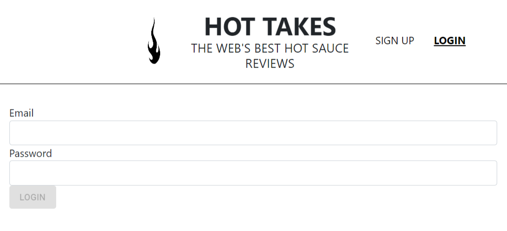

# Piiquante  

<h1>P6 · Construisez une API sécurisée pour une application d'avis gastronomiques.</h1>

<h2>Configuration de l'environnement de travail et initialisation du projet.</h2>

<b>Cloner dans le dossier "frontend" le code fourni pour initialiser ce projet depuis ce repository : </b>

    https://github.com/OpenClassrooms-Student-Center/Web-Developer-P6     

<b>Initialiser un dépôt Git del projecte.</b>

Depuis la terminal, entrer dans le répertoire frontend "cd frontend" et exécuter "npm install" pour installer les dépendances requises par l'application. Lancer le serveur de développement avec "npm run start", et on peut maintenant ouvrir la page http://localhost:4200 dans le navigateur.

<b>Il est important d'avoir un terminal en cours d'exécution "npm run start" pendant que nous travaillons pour pouvoir tester le code en temps réel.</b>

 

. N'oublier pas de créer un fichier ".gitignore" contenant la ligne "node_modules" pour éviter surcharger le dépôt.

. Pour terminer la configuration de notre environnement de développement, à partir de la racine du projet, créer un autre dossier appelé "backend". 
. Ouvrir un autre terminal et aller dans ce dossier "cd backend", pour initialiser le projet en exécutant "npm init". L'unique chose à changer c'est "server.js" comme point d'entrée.  
. Un fichier "package.json" est généré dans lequel les détails de tous les packages "npm" qui seront utilisés dans le projet seront enregistrés.

<h2>Construire le serveur.</h2>

. Créer le premier serveur Node avec le fichier "server.js" dans le dossier backend.

<b>Démarrer le server.</b>

        
· Importer le package http depuis Node.

        
· Créer le corps du serveur.

        
· Déclarer le port de connexion"3000" et l'alternative.

<b>Recommandation:</b>

        
· Utiliser l'outil de test Postman pour effectuer les requêtes vers l'URL: http://localhost:3000 .

<b>Installer nodemon</b>

        
· Depuis le backend exécuter la commande: "npm install -g nodemon" .

        
· Désormais, au lieu d'utiliser "node server" pour démarrer le serveur, utiliser "nodemon server" .

 Nodemon surveille les modifications des fichiers et redémarre le serveur et garantit d'avoir le server toujours mise à jour sans devoir le relancer manuallement.

<h2>Créer l'aplication Express.</h2>

L'utilisation du framework Express simplifie les tâches pour coder des serveurs web en Node, en nous permettant de déployer nos API beaucoup plus rapidement.

<b>Installer Express.</b>

        
· Exécuter la commande "npm install express --save" à partir du dossier backend.

        
· Créer un fichier "app.js" pour placer l'aplication Express.

        
· Exécuter l'application Express sur le serveur Node.

<b>Préparer des middlewares.</b>

    
· Chaque élément de middleware reçoit les objets <b>request</b> et <b>response</b>, peut les lire, les analyser et les manipuler, le cas échéant.   
    · Le middleware Express reçoit également la méthode <b>next</b> , qui permet à chaque middleware de passer l'exécution au middleware suivant.  
    · Cette application Express contiendra huit éléments de middleware.

<b>Améliorer server.js.</b>

    
· La fonction normalizePort renvoie un port valide, qu'il soit fourni sous la forme d'un numéro ou d'une chaîne ; 
    · La fonction errorHandler recherche les différentes erreurs et les gère de manière appropriée. Elle est ensuite enregistrée dans le serveur ; 
    · Un écouteur d'évènements est également enregistré, consignant le port ou le canal nommé sur lequel le serveur s'exécute dans la console.

<h2>Configurez votre base de données. MongoDB</h2>

MongoDB est une base de données NoSQL. Cela signifie que l'on ne peut pas utiliser SQL pour communiquer avec.  
Les données sont stockées comme des collections de documents individuels décrits en JSON "JavaScript Object Notation".  
Il n'y a pas de schéma strict de données "on peut écrire, en gros, ce que l'on veut où l'on veut", et il n'y a pas de relation concrète entre les différentes données.

<b>Configurer MongoDB Atlas.</b>

        
· Créer un compte gratuit sur le site web de MongoDB.

        
· Créer un <i>cluster</i> configuré avec l'<b>option AWS</b> et <b>uniquement les options gratuites</b>.

        
· Ajouter un utilisateur disposant de la capacité de lecture et d'écriture pour n'importe quelle base de données, dans l'onglet <b>Database Access</b>. 
        N'oublier pas de bien noter le nom d'utilisateur et le mot de passe pour connecter l'API au <i>cluster</i>.

        
· Dans l'onglet <b>Network Access</b> ajouter une adresse IP "ADD IP ADDRESS", choisir l'option "ALLOW ACCESS FROM ANYWHERE" qui permet à tout utilisateur d'accéder à l'API. Une entrée de liste blanche sera créée avec l'IP "0.0.0.0".

<b>Connecter l'API au <i>cluster</i> MongoDB.</b>

        
· Dans l'onglet <b>Atlas</b> cliquer sur <b>Connect</b> et choisir <b>Connect your application</b>.
        
· Sélectionner la version la plus récente de Node.js, et <b>Connection String Only</b>.

        
· Copier la chaine de caractères du code retournée. Exemple:  
        mongodb+srv://<b>NomUtilisateur</b>:<b>password</b>@clusterocr.76dpav8.mongodb.net/?retryWrites=true&w=majority

        
· Revenir au projet et, à partir du backend, exécuter "npm install mongoose" pour installer le package Mongoose.

        
· Importer et connecter mongoose dans app.js.

<h2>Préparer la base de données pour les informations d'authentification.</h2>

· Étant donné que l'authentification doit être implémentée dans l'API, par e-mail et mot de passe, le mot de passe de chaque utilisateur doit être stocké sous la forme d'un <b>hash</b> ou d'une chaîne chiffrée.

<b>Créer un modèle de données.</b>

        
· Afin qu'il n'y ait pas d'e-mails en double entre différents utilisateurs, nous utiliserons dans le schéma le mot-clé <b>"unique"</b> pour l'attribut d'e-mail.

        
· On peut avoir des erreurs ilisibles de la part de mongoose, pour le résoudre; installer un package de validation pour prévalider les informations avant de les enregistrer. Exécuter la commande suivante à partir du backend "npm install --save mongoose-unique-validator".

        
· Ajouter et appliquer ce validateur en tant que plug-in au schéma.

<h2>Créer des utilisateurs.</h2>

<b>Configurer les routes d'authentification.</b>

        
· On besoin un contrôlleur et un routeur, puis enregistrer ce routeur dans l'application Express.

        
· Créer le dossier controllers et dedans le fichier user.js.

        
· Créer le dossier routes et dedans, a nouveau un autre fichier user.js.

        
· Créer les routes d'authentification selon sont prévues par l'application front-end.

        
. Importer le routeur dans app.js et enregistrer les routes vers la racine API de toutes les routes.

        
· Importer le controlleur dans routes/user.js pour associer les fonctions des differentes routes, utilisant deux routes POST avec les métodes "/signup" et "/login".

<b>Créer des utilisateurs.</b>

        
· Comencer par installer le package de chiffrement <b>bcrypt</b> pour la fonction <b>signup</b>  "npm install --save bcrypt".

        
. Importer le model User dans le controlleur.

        
· Importer également bcrypt.

        
· Dans la fonction signup, hacher le mot de pass et avec le <b>hash</b> créé par bcrypt, s'enregistre l'utilisateur "user" dans la base de donnés.

<h2>Vérifiez l'identification d'un utilisateur.</h2>

<b>Implémenter la fonction login.</b>

        
· Dans cette fonction, les informations d'identification de l'utilisateur sont vérifiées, le user_id est transmis à partir de la base de données ainsi qu'un token web JSON signé(contenant également l'_id de l'utilisateur).

        
· Notre modèle Mongoose permet de vérifier si l'email saisi par l'utilisateur existe dans la base de données :

        
     - Sinon, une erreur <b>"401 Unauthorized"</b> est envoyée.

        
     - Si l'e-mail correspond à un utilisateur existant, continue.

        
· Pour comparer le mot de passe saisi par l'utilisateur avec le <b>hash</b> enregistré dans la base de données, c'est utilisée la fonction "compare" de "bcrypt".

        
     - S'ils ne correspondent pas, nous renvoyons une erreur <b>"401 Unauthorized"</b> avec le même message que lorsque l’utilisateur n’a pas été trouvé, afin de ne pas laisser quelqu’un vérifier si une autre personne est inscrite sur notre site.

        
     - S'ils correspondent, les informations d'identification de notre utilisateur sont valides. Dans ce cas, nous renvoyons une réponse <b>"200</b> contenant l'ID utilisateur et un token. Ce token est une chaîne générique pour l'instant, mais nous allons le modifier et le crypter dans le prochain chapitre.

<h2>Créer des tokens d'authentification.</h2>

Les <i>tokens</i> d'authentification permettent aux utilisateurs de se connecter une seule fois à leur compte. Lorsqu'ils se connectent, ils reçoivent leur <i>token</i> et le transmettent immédiatement dans chaque requête, ce qui permet au back-end de vérifier que la requête est authentifiée.

<b>Créer des tokens d'authentification.</b>

        
· Pour créer et vérifier les <i>tokens</i> d'authentification, nous avons besoin d'un nouveau package, installez-le avec la commande suivante : "npm install --save jsonwebtoken".

        
· Importer le package dans notre contrôleur utilisateur.

        
· L'utiliser dans la fonction <b>login.</b>

        
· Utiliser la fonction <b>sign</b> de <b>jsonwebtoken</b> pour chiffrer un nouveau <i>token</i>.

        
· Utiliser une chaîne secrète pour crypter le <i>token</i>; <b>CLAU_SECRETA_ALEAT0RIA_PER_ESMIC0LAR_C0NTRASENYA</b> .

        
· Définir la durée de validité du <i>token</i> à 24h.

        
. Envoyer le <i>token</i> au front-end avec la réponse.

<h2>Configurer le middleware d'authentification.</h2>

· Créer un dossier middleware et un fichier auth.js à l'intérieur.

· Dans ce middleware : 
        · Étant donné que de nombreux problèmes peuvent se produire, nous insérons tout à l'intérieur d'un bloc <b>try...catch</b>. 
        · Nous extrayons le <i>token</i> du header <b>Authorization</b> de la requête entrante. N'oubliez pas qu'il contiendra également le mot-clé <b>Bearer</b>. Nous utilisons donc la fonction <b>split</b> pour tout récupérer après l'espace dans le header. Les erreurs générées ici s'afficheront dans le bloc <b>catch</b>. 
        · Nous utilisons ensuite la fonction <b>verify</b> pour décoder notre <i>token</i>. Si celui-ci n'est pas valide, une erreur sera générée. 
        · Nous extrayons l'ID utilisateur de notre <i>token</i> et le rajoutons à l’objet <b>Request</b> afin que nos différentes routes puissent l’exploiter. 
        · Dans le cas contraire, tout fonctionne et notre utilisateur est authentifié. Nous passons à l'exécution à l'aide de la fonction <b>next()</b>.

· Maintenant, nous devons appliquer ce <i>middleware</i> à nos routes <b>stuff</b>, qui sont celles à protéger. Dans notre routeur <b>stuff</b>, nous importons notre <i>middleware</i> et le passons comme argument aux routes à protéger.

<h2> .</h2>
